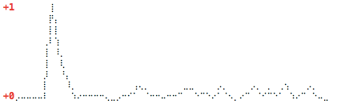

Read and show single metrics from [atop](http://www.atoptool.nl/) raw logs. This is for example nice to show average CPU load in a nice text mode diagram using unicode braille characters on login.

The script parses atop binary data files directly (no `atop` binary required at read time). It can dump data as CSV, JSON or ASCII table and plot simple graphs via [gnuplot](http://www.gnuplot.info/) or [diagram](https://github.com/tehmaze/diagram).

### Warning

* __No batteries included__ ... this is just the code I use. __It's not actively maintained__. It's just here in case it's useful for somebody.
* __Require compatible atop version__ — binary files must be from atop 1.26. Files from different atop versions or architectures may not parse correctly.

### Requirements

* Python 3.8+
* A raw logfile recorded by __atop__. Install atop on Ubuntu/Debian (`apt-get install atop`) or RedHat/CentOS (`yum install atop`) — it ships with a cronjob that writes data to `/var/log/atop/atop_YYYYMMDD` every few minutes. Otherwise record manually with [`atop -w`](http://linux.die.net/man/1/atop).
* Python dependencies: `atoparser`, `tabulate`, `pydash`, `diagram`

### Installation

1. Checkout the repository and install via `pip3 install ./aplot` (where `./aplot` is the path to the checkout).
2. (optional) Add your preferred call to `~/.profile` to show it on login.

### Usage

Global options (`-p`, `-e`, `-r`) can be placed before or after the subcommand name.

```
python3 -m aplot <subcommand> [options]
```

**Subcommands:**

| Subcommand | Description |
|---|---|
| `metrics` | Print all available metric paths |
| `users` | Print all user IDs (and names) seen in the data |
| `csv [metric...]` | Print results as CSV |
| `json [metric...]` | Print results as JSON |
| `table [metric...]` | Print results as an ASCII table |
| `diagram [metric...]` | Plot results as a braille character diagram |
| `gnuplot [metric...]` | Plot results using a gnuplot subprocess |

**Options (available on all subcommands):**

```
-p <path>, --path <path>    Path to atop raw log file(s). Use strftime placeholders
                            (%Y, %m, %d) for date-based file sets, or a direct path
                            for a single file. [default: /var/log/atop/atop_%Y%m%d]
-e <time>, --end <time>     Latest timestamp to include, in ISO 8601 format. [default: now]
-r <hours>, --range <hours> Number of hours backwards from --end to include. [default: 6]
```

**Options for `csv`, `json`, `table`, `diagram`, `gnuplot`:**

```
metric...                   One or more metric paths to display. [default: CPL.avg5]
-u <user>, --user <user>    Show per-interval aggregated stats for a user (name or UID)
                            instead of system metrics. Metrics default to all user fields.
```

**Additional options for `diagram` and `gnuplot`:**

```
-x <cols>, --width <cols>   Graph width in columns. [default: 59]
-y <lines>, --height <lines> Graph height in lines. [default: 9]
```

#### Metrics

Use `aplot metrics` to list available metrics for your data. Common ones:

* `CPL.avg1`, `CPL.avg5`, `CPL.avg15`, `CPL.csw`, `CPL.intr`
* `CPU.idle`, `CPU.irq`, `CPU.sys`, `CPU.user`, `CPU.wait`
* `DSK.<name>.avio`, `DSK.<name>.busy`, `DSK.<name>.read`, `DSK.<name>.write`
* `MEM.buff`, `MEM.cache`, `MEM.free`, `MEM.physmem`, `MEM.slab`
* `NET.<iface>.pcki`, `NET.<iface>.pcko`, `NET.<iface>.si`, `NET.<iface>.so`
* `NET.network.ipi`, `NET.network.ipo`, `NET.transport.tcpi`, `NET.transport.tcpo`
* `PAG.scan`, `PAG.stall`, `PAG.swin`, `PAG.swout`
* `PRC.exit`, `PRC.proc`, `SWP.free`, `SWP.tot`

#### User metrics

When `--user` is given, the following fields are available as metrics:

| Field | Description |
|---|---|
| `procs` | Number of processes owned by the user in this interval |
| `utime` | Aggregated user CPU ticks |
| `stime` | Aggregated system CPU ticks |
| `vmem` | Total virtual memory (bytes) |
| `rmem` | Total resident memory (bytes) |

### Examples

##### Default diagram (CPU load average)

```
aplot diagram
```



##### CSV export over a date range

```
aplot csv --path 'data/atop_%Y%m%d' --end '2026-06-18T23:59:00' --range 168 \
    CPL.avg5 CPU.user CPU.idle MEM.free
```

##### JSON output

```
aplot json CPL.avg5 SWP.free MEM.free --range 1
```

```json
{
   "2016-08-06T12:09:57": { "CPL.avg5": 0.14, "MEM.free": 878077542, "SWP.free": 15998753177 },
   "2016-08-06T12:19:57": { "CPL.avg5": 0.11, "MEM.free": 875560960, "SWP.free": 15998753177 }
}
```

##### List users seen in a specific file

```
aplot users --path data/atop_20260616
```

##### Per-user CPU and memory table

```
aplot table --path 'data/atop_%Y%m%d' --range 24 --user 1004
aplot table --path 'data/atop_%Y%m%d' --range 24 --user alice utime stime
```

##### Single file (no date placeholder)

```
aplot csv --path data/atop_20260616 CPL.avg5
```

### Related

* The tool `atopsar` also allows to get reports and statistics from atop raw logfiles.
